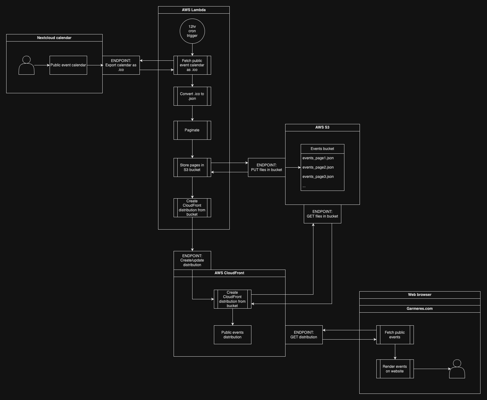

# Garmeres public event calendar

This repo is a test project, where the goal is to have a public endpoint where one may fetch a list of upcoming events from an
internally managed Nextcloud calendar.

In other words, when Garmeres members with access to [Balve](https://balve.garmeres.com) update a given Nextcloud calendar, then this calendar's events will be automatically published to the [Garmeres website](https://garmeres.com).

## Architecture

Nextcloud Calendar offers an endpoint to export a given calendar. To reduce network traffic in Balve, the calendar shall be exported once every 24 hours, processed into a list of events in JSON format and stored in an AWS S3 bucket. An AWS CloudFront distribution will be created from this S3 bucket to reduce costs of requests. The website may then fetch a list of events directly from the CloudFront distribution.

